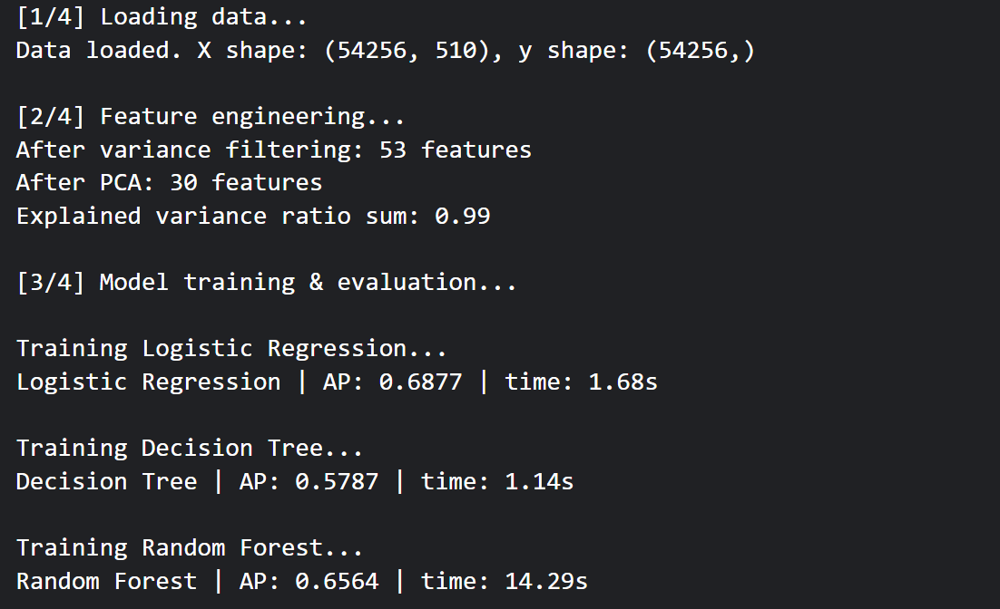
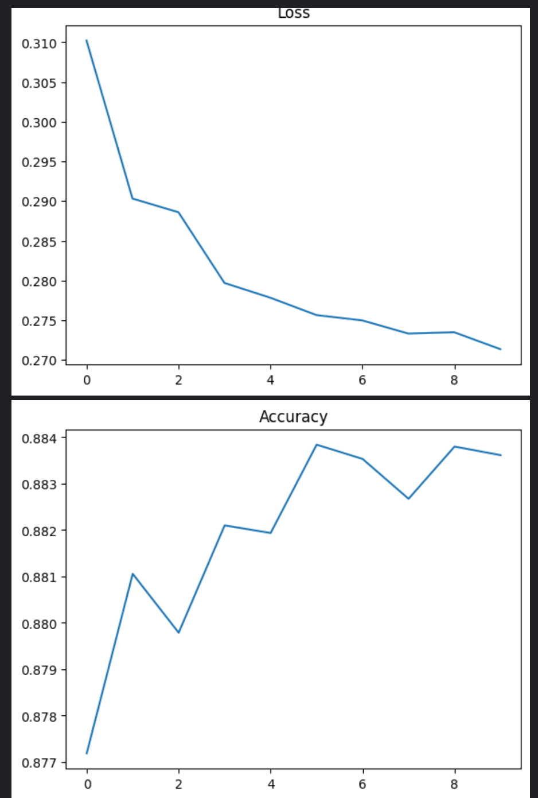
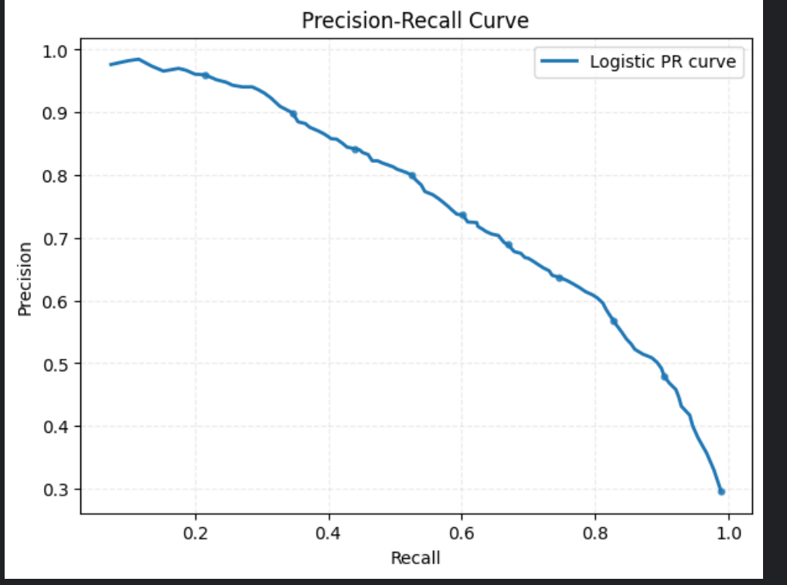
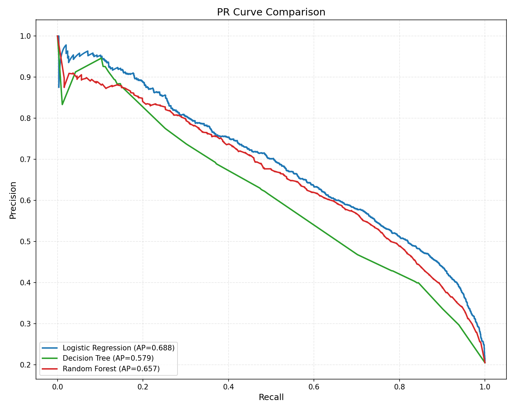

# 机器学习实验二报告（二元分类）

## 基本信息

- 学号：3124001493
- 系级：24大数据
- 姓名：刘焯林

---

## 1. 在 `ex2_logistic_original.ipynb` 中训练 Logistic 模型并调试超参数

### 1.1 训练涉及的超参数

本实验中调试的核心超参数如下：

- `max_iter = 10`
- `batch_size = 8`
- `learning_rate = 0.2`

### 1.2 参数与训练表现分析

1. 训练速度特征
   - 小批量训练（`batch_size=8`）下，单次更新较快
   - 在 CPU 环境中可稳定运行

2. 结果现象
   - 损失曲线整体下降，说明模型在收敛
   - 准确率曲线整体上升，说明训练有效
   - 后期曲线趋于平稳，继续增加迭代的收益会变小

3. 参数变化趋势
   - `learning_rate` 过小：收敛更稳定但训练时间增加
   - `learning_rate` 过大：收敛更快但可能出现振荡
   - `batch_size` 更小：更新更频繁，通常更慢、波动更大
   - `max_iter` 增大：时间近似线性增加，效果提升逐步减弱

### 1.3 程序输出结果

训练日志截图：



Loss / Accuracy 曲线：



Logistic PR 曲线：



---

## 2. 在 `ex2_logistic_xgboost.ipynb` 中完成多模型对比与问答

### 2.1 四种模型 PR 曲线与结果对比

本次运行输出如下：

| 模型 | AP | 训练时间（秒） | 结论 |
|---|---:|---:|---|
| Logistic Regression | **0.6877** | 1.68 | AP 最好，综合表现最佳 |
| Decision Tree | 0.5787 | **1.14** | 训练最快，但精度最低 |
| Random Forest | 0.6564 | 14.29 | AP 次优，但耗时明显更高 |

结论分析：

- AP 排名：`Logistic > Random Forest > Decision Tree`
- 时间成本：`Decision Tree < Logistic << Random Forest`
- 在当前特征工程与参数设置下，Logistic 的精度-效率平衡最好。

PR 对比图如下：



---

### 2.2 采用了哪种特征工程？原理、实现过程、影响

本实验特征工程流程为：方差筛选 + 标准化 + PCA。

1. 方差筛选（VarianceThreshold）
   - 原理：删除方差过低、区分能力弱的特征
   - 实现：`VarianceThreshold(threshold=0.1)`

2. 标准化（StandardScaler）
   - 原理：统一量纲，避免某些特征数值过大主导训练
   - 实现：`fit_transform / transform`，并对极端值进行 `np.clip(-10, 10)`

3. PCA 降维
   - 原理：在保留主要信息的前提下降低维度，减少冗余特征
   - 实现：根据维度动态设置主成分数，本次最终降到 30 维

#### 本次运行的量化结果

| 处理阶段 | 特征维度 | 备注 |
|---|---:|---|
| 原始数据 | 510 | X shape: `(54256, 510)` |
| 方差筛选后 | 53 | `After variance filtering: 53 features` |
| PCA 后 | 30 | `After PCA: 30 features` |
| PCA 解释方差比 | 0.99 | `Explained variance ratio sum: 0.99` |

影响分析：

- 从 510 维降到 30 维，压缩比例高，训练更高效
- 同时保留 99% 方差信息，说明信息损失较小
- 这也是 Logistic 在 AP 上取得最好结果的重要原因之一

---

### 2.3 简述正则化的作用，以及对模型影响

正则化通过对参数加惩罚项来限制参数过大，核心目标是抑制过拟合、提高泛化能力。

- L1 正则：可产生稀疏权重，有特征选择效果
- L2 正则：让参数更平滑，训练更稳定

对模型影响：

- 训练集指标可能略降
- 测试集稳定性通常更好
- PR 曲线在验证/测试集上更可靠

---

### 2.4 XGBoost 相对于 Logistic 的优势

XGBoost 相对 Logistic 的优势：

- 能建模非线性关系与特征交互
- Boosting 框架通常有更高精度上限
- 自带正则化与采样机制，泛化能力强

代价：

- 参数更多，调参复杂
- 训练时间更高（尤其在集成模型中）
- 可解释性通常弱于 Logistic

---

## 3. 图片清单：需要截哪些图、如何获取

1. `original_train_log.png`
   - 来源：`ex2_logistic_original.ipynb` 训练输出区
   - 内容：训练集大小、测试集大小、最终 loss、最终 accuracy

2. `loss_acc.png`
   - 来源：`ex2_logistic_original.ipynb` 的 Loss/Accuracy 绘图单元
   - 可保存命令：
```python
plt.savefig('loss_acc.png', dpi=150, bbox_inches='tight')
```

3. `logistic_pr.png`
   - 来源：`ex2_logistic_original.ipynb` 的 PR 绘图单元
   - 可保存命令：
```python
plt.savefig('logistic_pr.png', dpi=150, bbox_inches='tight')
```

4. `pr_comparison.png`
   - 来源：`ex2_logistic_xgboost.ipynb`
   - 内容：多模型 PR 对比图

5. （可选）`feature_steps.png`
   - 内容：方差筛选、标准化、PCA 三段核心代码截图
   - 用于增强特征工程描述的可读性

---

## 4. 复现与提交建议

1. 运行 `ex2_logistic_original.ipynb`，生成训练日志图、loss/acc 图、logistic PR 图。  
2. 运行 `ex2_logistic_xgboost.ipynb`，生成 `pr_comparison.png`。  
3. 用你的最终实测结果替换报告中“占位符信息”（学号/系级/姓名）。  
4. 检查图片路径后导出为 `report.pdf` 提交。  
